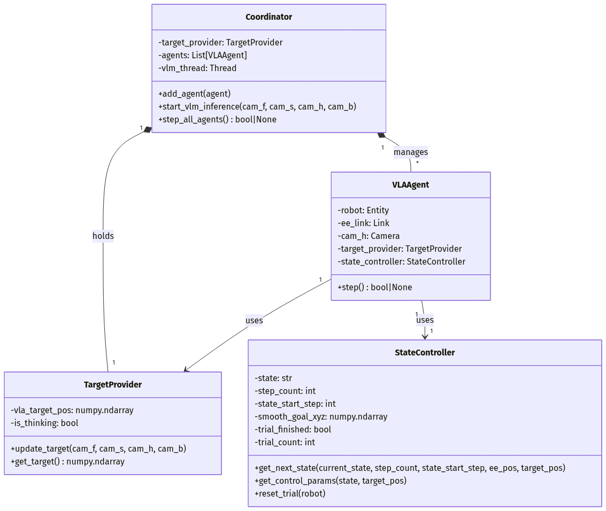

# Multi-Agent VLA Robotic Control System with Genesis

このプロジェクトは、物理シミュレータ **Genesis** とローカルLLM実行環境 **Ollama (LLaVA)** を組み合わせた、マルチエージェント方式のロボット制御シミュレーションです。視覚情報をベースに、物体（レッドキューブ）のピック＆リフト動作を自律的に行います。

---

## 1. システムアーキテクチャ

本システムは、モノリシックな制御構造を避け、「役割」ごとにエージェントを分離したマルチエージェント設計を採用しています。各エージェントは **Blackboard (共有メモリ)** クラスを介して非同期に通信し、物理シミュレーションのリアルタイム性を維持します。

### エージェント構成図



### 各コンポーネントの詳細

| エージェント | 分類 | 主な役割 |
| :--- | :--- | :--- |
| **Blackboard** | 通信 | ターゲット座標、状態フラグ、推論ステータスの同期。 |
| **Perception Agent** | 認識 | 4視点のカメラ画像を取得・エンコードし、Ollama APIへ送信。得られた座標をBlackboardに書き込む。 |
| **Brain Agent** | 判断 | ステップ数と目標距離を監視し、`APPROACH` / `DESCEND` / `GRASP` / `LIFT` の状態遷移を管理。 |
| **Controller Agent** | 制御 | 状態に応じた目標値に対し、IK（逆運動学）と LERP（線形補間）を用いてロボットのDOFsを制御。 |

---

## 2. 制御アルゴリズムの解説

### 2.1 状態遷移 (State Machine)
`BrainAgent` は以下の条件に基づいて、ロボットのフェーズを切り替えます。

1.  **APPROACH**: ターゲットのXY座標直上、高さ25cmへ急行。距離4cm以内で遷移。
2.  **DESCEND**: ターゲットの把持ポイント（高さ2.5cm）まで低速降下。EE高さ5.5cm以下で遷移。
3.  **GRASP**: グリッパーを閉鎖。物理的な密着を待つため200ステップ待機。
4.  **LIFT**: 高さ40cmまで上昇。

### 2.2 滑らかな追従 (LERP Control)
VLAからの座標更新は非連続的であるため、以下の線形補間（LERP）を用いてロボットの挙動を安定させています。

$$P_{next} = (1 - \text{speed}) \cdot P_{current} + \text{speed} \cdot P_{target}$$

* **APPROACH時**: `speed = 0.02` (高速)
* **DESCEND時**: `speed = 0.005` (精密・低速)

---

## 3. 技術的特徴

* **非同期推論の分離**: `requests` によるAPI通信を別スレッドで実行することで、LLMの推論待ち（数秒程度）の間も物理エンジンが停止せず、ロボットが既存のターゲットに向かって動き続けることができます。
* **座標フィルタリング**: VLAが返すノイズを含んだ座標に対し、80%の新規採用率で指数移動平均をかけることで、ガタつきのないスムーズなトラッキングを実現しています。
* **物理チェック**: `LIFT` 状態の最後にグリッパーの幅（Finger Gap）を確認し、物体が実際に指の間に存在するかを判定するロジックを備えています。

---

## 4. 実行環境の構築

### 必要なライブラリ
```bash
pip install genesis-world numpy requests Pillow
